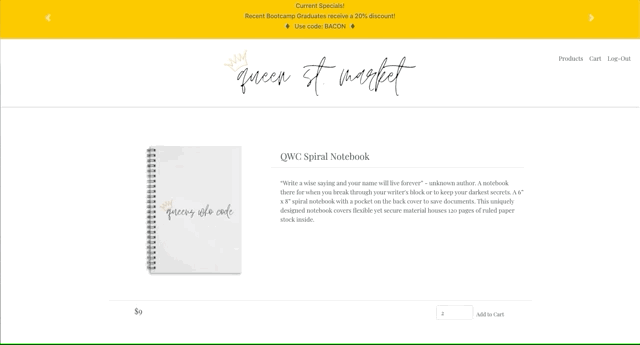
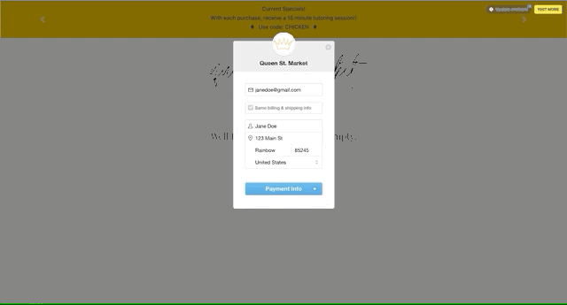

  

# The App

Queen St Market is an online store where the user can go shop for a product, view the details of said product, add it to the cart and then checkout. The user muct sign-up and log in in order to access the cart and checkout pages of the app. Once logged in their cart is saved until they are ready to checkout. If the user changed their mind about the quantity of products of if they decide to delete their cart they can do so with a few clicks. 

This is a MERN application (Mongo, Express, React and Node) and we will be detailling how we used these and other tools to build our Queen St Market application. 

# Getting Started

This was a collaboration project that took a lot of planning and several reassessments along the way. The first steps were to come to an agreement on where the project should go and what was our MVP (Minimal Viable Product).
To accomplish this we first created our User Stories.

## User Stories

Here are some of the user stories we came up with that helped us guide and initialize our project.

1. The user can log-in by accessing a form were they can input their information. 
2. They can logout by simply clicking on a navbar element.
3. The user can have access to our products without having to log-in.
4. The user can also view the details of a product by clicking a button that leads them to the product specifics also without having to log in. 
5. Each user has a personal cart that is protected by authentication. 
6. They can securely checkout with a dedicated application that especializes in credit card protection such as Stripe.
7. Their orders are stored so we can later remind them of their previous purchases. 
8. User is guided through the website effortlesly without feeling lost or not knowing where to go.

Once the User Stories were defined we moved on to decide how we wanted to build this application and which tools we were going to use.

## Why MERN?

When deciding how to build this aplication, a MERN APP seemed to be the perfect fit for us. 

A Mongo Database was the right choice since we did not need excessive realtional associations. The only relations were between the user and their cart and with the help of Mongoose we were able to create those simple relations with ease. 

Express being a server widly used made simple to integrate our back end elements such as mongoose, passport for our authentication and all our routes that worked with the front end through Axios calls. 

React was our front-end choice since we all wanted to gain some exprience with it. We decided to incorporate React Hooks as well. The fact that React is a full javascript library made it easier to integrate our UI the functionality of the app: We could build a card and have it update a product quantity of a product in the same file space. 

Finally we used Node to ease our development and allows to write our javascript code and test it right on our terminal. Node also made it possible to require our dependencies, export our files through module and use Command Lines to start our application, seed our database and much more. 

## Choosing our Dependencies

After deciding what type of application we wanted to build, the next step was to decide what dependencies we wanted to use to facilitate the process. There are many libraries to choose from and therefore we had to do our due dilligence and research which ones would better serve our needs. Our main research hub was the [NPM](https://www.npmjs.com/) website where all the packages we used have readmes with all the information we need to know about it. We also rely heavly on google and forums where other developers shared their experiences with these packages. 

# Sample Images

Before we launch ourselves in explaining our creation process, our codes highlights, challenges and process, we want to share our final MVP images and the fucntionality of the app in the GIF's below.

## Sign-up, Log-in and Log-out

The user can sign-up and log-in to our store which allows them to have their own cart and to checkout safely. Tthey can also manually log-out if they so choose to. 

  

## Product interaction

The user does not need to be authenticated in order to puruse the products or to view one product's details. In the product detail page, the user can adjust the quantity of the product before adding it to cart. 

## Cart Functionality

If the user is not logged -in or signed-up they cannot access the cart and will be prompted to log-in by a modal. Once in the cart, the user can update the quantity of a product which will change the total amount they need to pay, delete a product or checkout.

## Checkout

Our checkout is executed by Stripe, the user will be prompted to input their email, their billing address and credit card information before performing the payment

